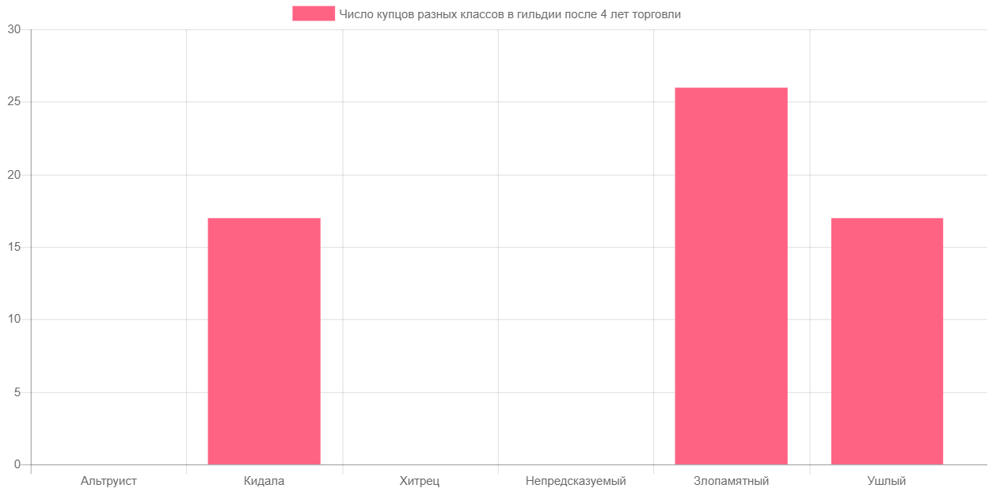
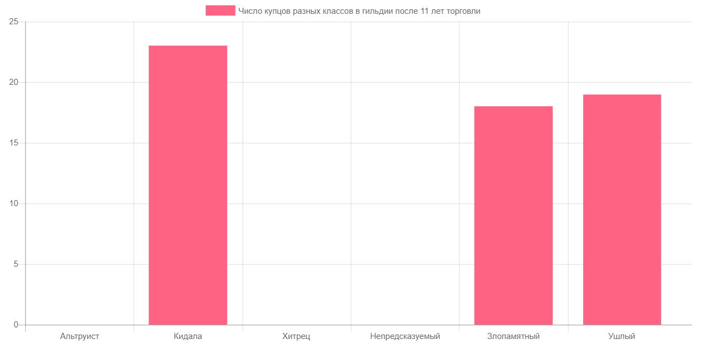

## Тестовое задание для летней школы RBKmoney

1.  Описанная модель реализованна на JavaScript ¯\\\_(ツ)\_/¯
2.  В долгосрочной перспективе наиболее выгодной является стратегия _кидала_

    

      
      
В относительно краткосрочной перспективе <i>кидала</i> может уступать <i>злопамятному</i> и <i>ушлому</i>

    

    

      
      
Однако в среднем к 10-15 году <i>кидала</i> оказывается наиболее выгодной стратегией

    

